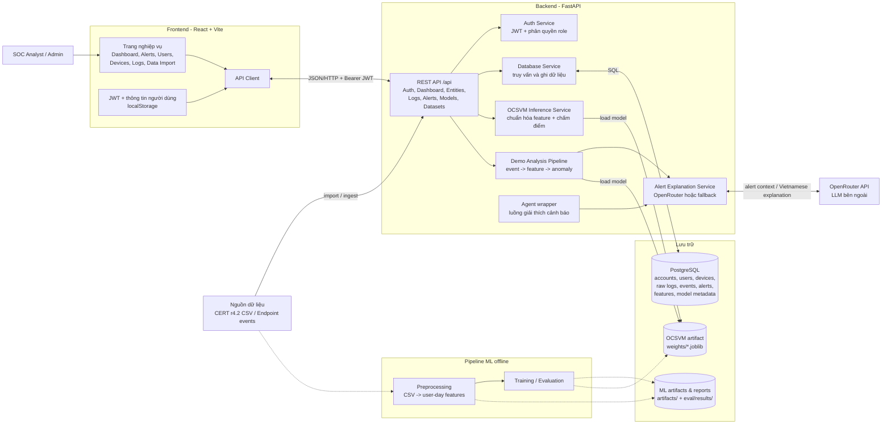
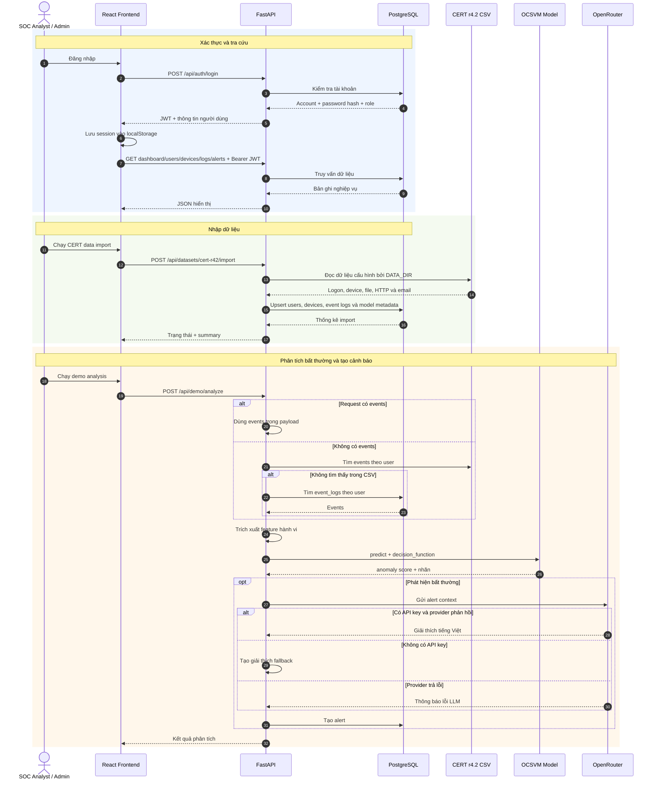

# Sơ đồ kiến trúc hệ thống UEBA

Tài liệu này mô tả các thành phần đang được triển khai và luồng dữ liệu chính của hệ thống phát hiện nguy cơ nội bộ dựa trên CERT r4.2, OCSVM và LLM.

## 1. Sơ đồ thành phần

Quy ước: mũi tên liền là luồng runtime; mũi tên nét đứt là xử lý ML offline.

## 2. Luồng dữ liệu runtime

## 3. Trách nhiệm và dữ liệu chính

| Thành phần | Trách nhiệm | Dữ liệu vào | Dữ liệu ra |
|---|---|---|---|
| React Frontend | Xác thực, điều hướng và hiển thị nghiệp vụ cho analyst/admin | Tương tác người dùng, JSON từ API | API request, dashboard và cảnh báo |
| FastAPI Routes | Điểm vào HTTP, kiểm tra schema, JWT và role | JSON, query params, Bearer token | JSON response, lệnh gọi service |
| Auth Service | Hash/verify mật khẩu, tạo và giải mã JWT | Credentials, account, JWT | Identity và role đã xác thực |
| Database Service | Quản lý accounts, users, devices, logs, alerts và metadata model | Payload đã kiểm tra | Bản ghi PostgreSQL |
| Demo Analysis Pipeline | Chuyển event thành feature và điều phối phân tích demo | Events từ request, CSV hoặc DB | Risk score, anomaly score, top factors |
| OCSVM Inference Service | Nạp model đã huấn luyện và suy luận feature vector | Feature dictionary / DataFrame | Nhãn anomaly, score, severity |
| LLM Explanation Service | Sinh giải thích cảnh báo tiếng Việt; có fallback cục bộ | Alert context | Nội dung giải thích |
| Offline ML Pipeline | Tiền xử lý CERT, tạo feature, huấn luyện và đánh giá | CSV CERT r4.2, LDAP, psychometric | Feature matrix, model artifact, báo cáo |

## 4. Ranh giới triển khai

- Backend khởi tạo schema PostgreSQL khi FastAPI startup.
- Frontend gọi API qua `VITE_API_BASE_URL`; các request bảo vệ gửi `Authorization: Bearer <jwt>`.
- Runtime không huấn luyện model. Hai endpoint model và demo analysis nạp OCSVM artifact đã có.
- Pipeline trong `src/services/ueba_ml/pipelines/` chạy offline và ghi kết quả vào `artifacts/` cùng `eval/results/`.
- `src/agents/` hiện là wrapper mỏng cho luồng giải thích; đường gọi demo hiện tại gọi explanation service trực tiếp.
- OpenRouter là phụ thuộc tùy chọn. Khi thiếu API key, hệ thống dùng giải thích dựa trên rule; lỗi từ provider được trả thành thông báo trong phần giải thích.
